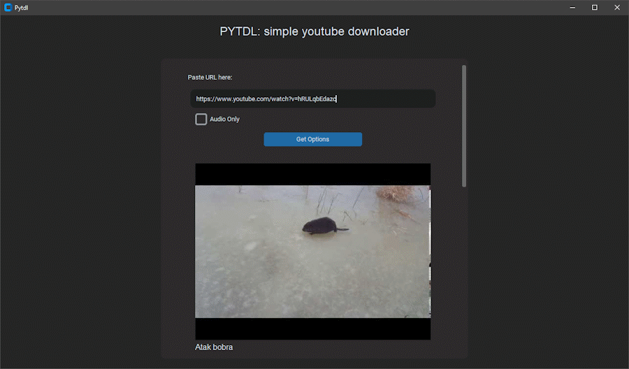

# PYTDL

Simple GUI application build with CustomTkinter that allows downloading youtube videos.

## Important notes
1. Most options get downloaded as separate audio and video streams which are then combined with FFmpeg. For this purpose the app creates temporary files for the streams!

2. Videos get downloaded as "title_of_the_video.mp4" into the set directory. This will overwrite anything that has the same filename in that directory!

## Dependencies

1. Install FFmpeg and have it accessible via the $PATH environment variable.

2. Install the required dependencies with the following command:

```bash
pip install -r requirements.txt
```

## Images



